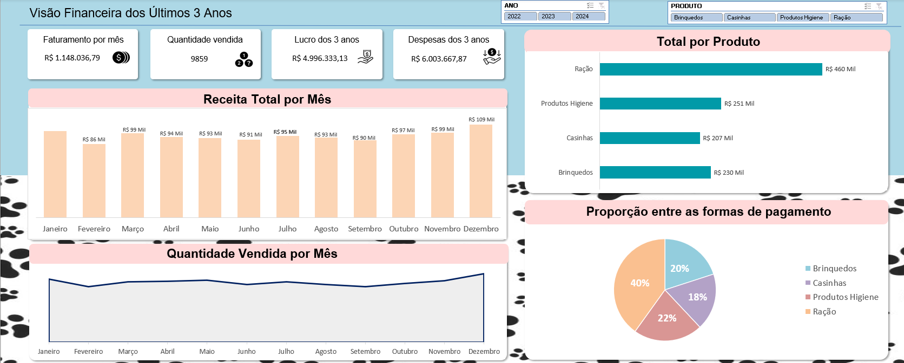

<h1>📊 Dashboard de Petshop</h1>

  Este projeto consiste em um dashboard interativo desenvolvido integralmente em <b>Excel Avançado</b>, com o objetivo de realizar uma análise financeira detalhada de um petshop.
  O processo incluiu o tratamento de dados de um arquivo <b>CSV</b>, organização e apresentação de métricas e insights financeiros para facilitar a tomada de decisões.

<h2>📂 Organização do Projeto</h2>
<pre>
data/
  ↳ baseDadosPetshop.csv
Dashboard_Financeiro_Petshop.xlsx
</pre>

<h2>📈 Funcionalidades do Dashboard</h2>

  O dashboard apresenta visualizações e métricas fundamentais para o acompanhamento financeiro, como:

<ul>
  <li><b>Produtos Mais Vendidos:</b> Lista de produtos com maior número de vendas, categorizados por período.</li>
  <li><b>Análise de Receita por Ano:</b> Identifica quais anos tiveram o melhor faturamento.</li>
  <li><b>Despesas e Lucro:</b> Comparativo dinâmico que varia de acordo com os filtros aplicados na segmentação de dados.</li>
  <li><b>Relatório de Desempenho:</b> Resumo das principais métricas financeiras do petshop.</li>
</ul>

<h2>❓ Perguntas que o Dashboard Responde</h2>
<ul>
  <li>Quais produtos lideram em vendas no petshop?</li>
  <li>Qual foi o faturamento do petshop nos últimos anos?</li>
  <li>Como as despesas e o lucro variaram ao longo dos anos?</li>
  <li>Quais segmentos de produtos contribuem mais para o lucro?</li>
</ul>

<h2>🛠️ Tecnologias Utilizadas</h2>
<ul>
  <li><b>Excel Avançado:</b> Para o desenvolvimento do dashboard e tratamento dos dados.</li>
  <li><b>CSV:</b> Fonte de dados para a análise.</li>
  <li><b>Segmentação de Dados:</b> Para filtros dinâmicos e personalização das análises.</li>
</ul>

<h2>🚀 Como Utilizar</h2>
<ol>
  <li>Faça o download deste repositório:</li>
  <pre>
https://github.com/seu-usuario/Dashboard_Financeiro_Petshop.git
  </pre>
  <li>Abra o arquivo <code>Dashboard_Financeiro_Petshop.xlsx</code> no Excel.</li>
  <li>Explore as segmentações de dados e os filtros para visualizar diferentes análises financeiras.</li>
</ol>

<h2>📬 Contato</h2>

  Se tiver dúvidas, sugestões ou quiser conhecer mais sobre meu trabalho, <a href="https://kaiquevfreitas.github.io/Site_Portifolio/">CLIQUE AQUI</a>.

