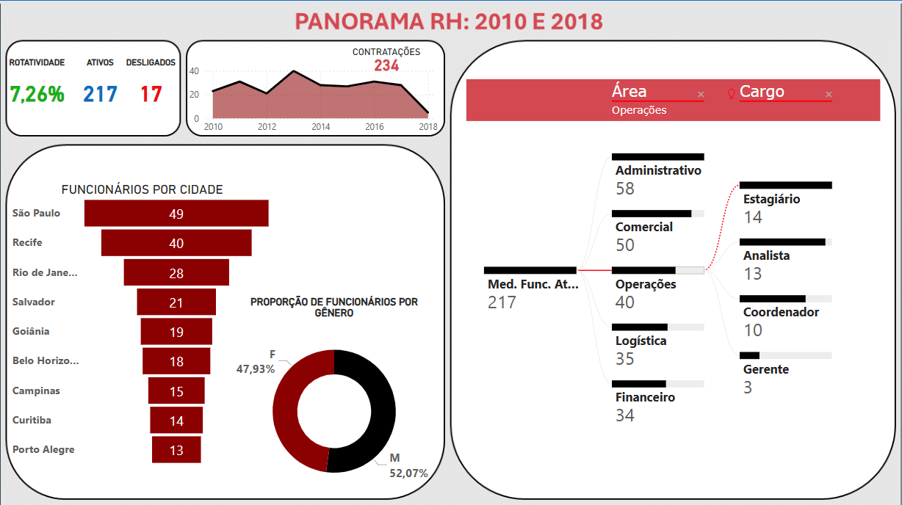

<h1>📊 Dashboards de Análise</h1>  

Este repositório reúne dois dashboards interativos para diferentes finalidades e tecnologias:
  

<b>Dashboard de Análise de RH:</b> Desenvolvido em Power BI, esse projeto organiza e analisa dados de Recursos Humanos, respondendo questões estratégicas como rotatividade, distribuição salarial e impacto financeiro de horas extras. Os dados foram tratados no Power Query e Excel, garantindo insights claros e precisos para decisões empresariais.
  

 

 

<b>Dashboard de Análise Financeira de Petshop:</b> Criado com Excel Avançado, apresenta uma análise detalhada das vendas e finanças de um petshop. Trata dados de um arquivo CSV para exibir produtos mais vendidos, anos com maior faturamento e comparativos dinâmicos de despesas e lucros, ajustáveis por filtros interativos.
  

Cada dashboard foi projetado para facilitar a interpretação de dados e otimizar tomadas de decisão em suas respectivas áreas.
  