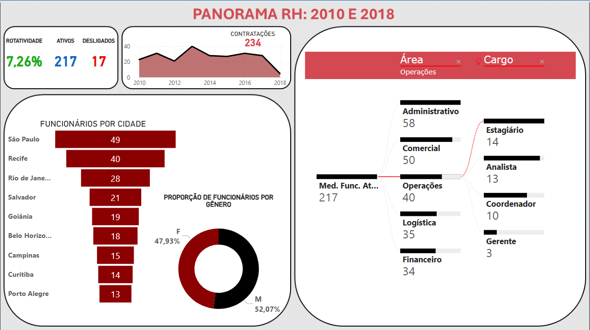

<h1>📊 Dashboard de Análise de RH</h1>

  Este projeto inclui um dashboard interativo desenvolvido em <b>Power BI</b>, com o objetivo de realizar análises detalhadas de dados de Recursos Humanos. 
  O processo inclui limpeza e organização dos dados em <b>Power Query</b> e <b>Excel</b>, a partir de um arquivo de texto bruto. 
  O dashboard oferece insights estratégicos para tomada de decisão.

<h2>📂 Organização do Projeto</h2>
<pre>
data/
  ↳ BaseFuncionarios.xlsx
  ↳ BaseFuncionarios.txt
Dashboard_AnaliseRH.pbix
</pre>

<h2>📈 Funcionalidades do Dashboard</h2>

  O dashboard inclui visualizações e métricas fundamentais para o acompanhamento estratégico de RH, como:

<ul>
  <li><b>Quantidade de Funcionários:</b> Total de funcionários ativos e desligados, com comparação por períodos ou setores.</li>
  <li><b>Horas Extras:</b> Total de horas extras realizadas, com análise por departamento e períodos.</li>
  <li><b>Análise de Salário e Folha de Pagamento:</b> Distribuição salarial e impacto das horas extras na folha de pagamento.</li>
  <li><b>Turnover (Rotatividade):</b> Taxa de rotatividade geral, com detalhamento por gênero, departamento ou período.</li>
  <li><b>Funcionários por Gênero:</b> Proporção de funcionários ativos por gênero, com análise de evolução histórica.</li>
</ul>

<h2>❓ Perguntas de RH que o Dashboard Responde</h2>
<ul>
  <li>Qual é o total atual de funcionários ativos e desligados na empresa?</li>
  <li>Qual o impacto financeiro das horas extras na folha de pagamento por período?</li>
  <li>Qual é a taxa de rotatividade (turnover) por departamento ou gênero?</li>
  <li>Como está distribuída a faixa salarial entre os diferentes departamentos?</li>
  <li>Qual é a proporção de funcionários por gênero e como isso evoluiu ao longo do tempo?</li>
</ul>

<h2>🛠️ Tecnologias Utilizadas</h2>
<ul>
  <li><b>Power BI:</b> Para desenvolvimento do dashboard interativo.</li>
  <li><b>Power Query:</b> Para limpeza e transformação dos dados.</li>
  <li><b>Excel:</b> Para organização e estruturação inicial dos dados.</li>
  <li><b>Arquivo de Texto:</b> Fonte bruta dos dados para processamento.</li>
</ul>

<h2>🚀 Como Utilizar</h2>
<ol>
  <li>Clone este repositório:</li>
  <pre>
git clone https://github.com/seu-usuario/Dashboard_AnaliseRH.git
  </pre>
  <li>Abra o arquivo <code>Dashboard_AnaliseRH.pbix</code> no Power BI Desktop.</li>
</ol>

<h2>📬 Contato</h2>

  Se tiver dúvidas, sugestões ou quiser conhecer mais sobre meu trabalho, <a href="https://kaiquevfreitas.github.io/Site_Portifolio/">CLIQUE AQUI</a>.

